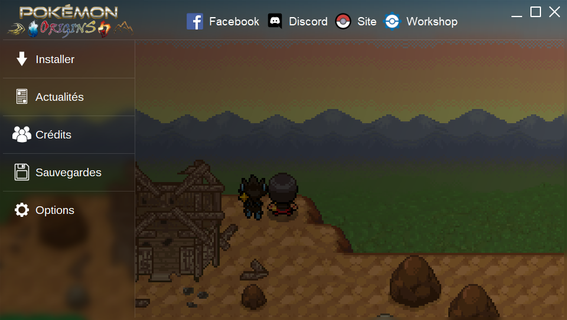
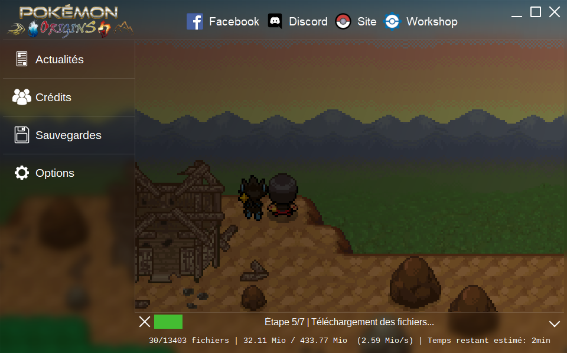
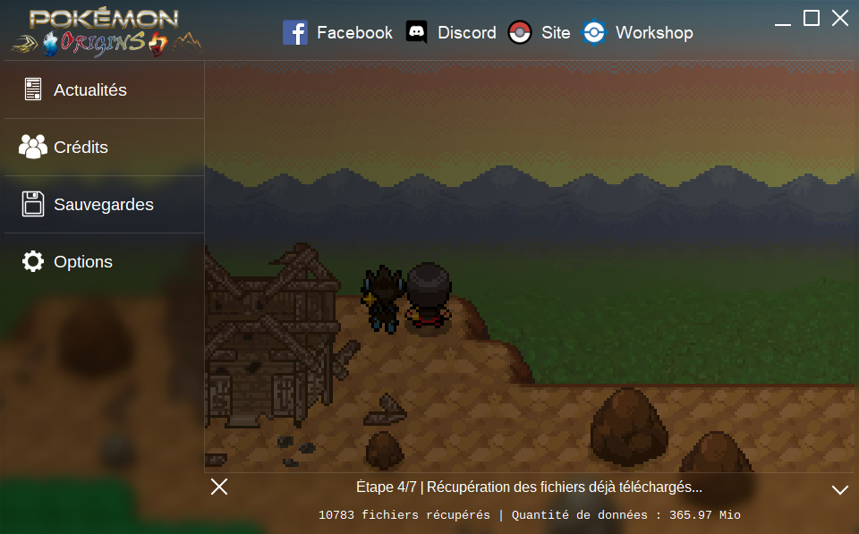

# game-launcher

A launcher made Qt for a fangame, it has a custom window frame combined with a simple design.
It has a save manager, a web integration to read project website's articles directly from it and, of course, an updater (separated process).

## The launcher at launch

## The launcher downloading the game

## The launcher restarting the download, keeping already downloaded files

